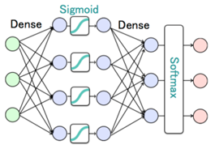

# keras について

## 必要

- tensorflow
- keras

## メソッド
### Sequential
```python
from keras.models import Sequential
from keras.layers import Dense, Activation

# モデルの構造を定義
model = Sequential()             # モデルの構造を定義するためのクラス
model.add(Dense(4, input_dim=3)) # 入力層のユニット数は、入力データの次元数と同じに
model.add(Activation('sigmoid')) # 活性化関数
model.add(Dense(3))              # 出力層のユニット数は、分類したいクラス数と同じにする
model.add(Activation('softmax')) # 活性化関数
model.summary()                  # モデルの構造を表示
model.compile(loss='categorical_crossentropy', optimizer='adam') # モデルのコンパイル, optimizer: 勾配法、loss: 損失関数

# モデルの学習
model.fit(X_train, Y_train, epochs=500) # 学習の実行, epochs: 学習の繰り返し回数

# テスト
loss = model.predict(X_test) # テストデータを入力して、出力を得る

```


> softmax関数は多くの次元からなる入力のうち、自分の値が他の値たちに比べて一番目立っているならば、その値が１に近づく関数である

