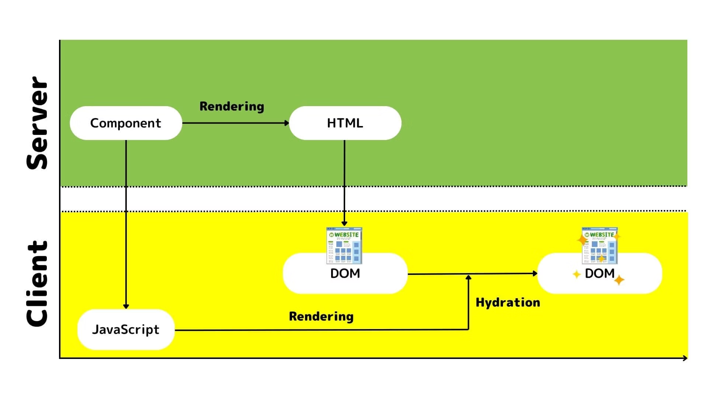

# Next.js 
- 参考: https://qiita.com/__knm__/items/32c632bbb93a107aca9e

## Next.js の主な機能
- プリレンダリング
  - SSR: Server Side Rendering 
  - SSG: Static Site Generation: 静的生成、ビルド時にレンダリングする
  - ISR: Incremental Static Regeneration： SSG の進化版。SSGのようにHTMLをビルド時に生成するが、「公開後も必要に応じて静的ページを再生成できる」仕組み。
  - CSR: Client-side Rendering: ブラウザ上で JS を実行し、DOMを生成する。useEffect などをしようする。
  - RSC: React Server Components: 

- ファイルベースルーティング（ダイナミックルート）
- API 作成（API Route）
- 開発者にやさしい開発環境（ゼロコンフィグ）

## ディレクトリ構成
- /pages
  - 配下のコンポーネントファイルが一つのページに対応する
  - pages/index.js = /
  - pages/about/index.js = /about
- /styles
  - CSS ファイルが格納される
- /public
  - 画像やフォントやアイコンなどの静的ファイル

## ルーティング手法
- 基本
  - ファイルまでのぱすがそのまま URL になる
  - ルーティング = URL で送信されたリクエストに対して、どのプログラムを実行するか紐づけること
- 動的ルーティング
  - /pages/blog/[number].js = /pages/blog/1 で
  - 同じ改装に固定の名称があれば、優先される。
  - useRouter フックで取得可能
```JavaScript
import { useRouter } from "next/router";

export default function Setting() {
  const router = useRouter(); // `query.name`などのプロパティを持つオブジェクトの格納
  return (
    <>
      <h1>{router.query.name}</h1>
    </>
  );
}
```
- useRouter 
  - push(): 画面遷移
```JavaScript
import { useRouter } from "next/router";
export default function Setting() {
  const router = useRouter();
  const clickHandler = () => {
    router.push("/"); // 引数に渡したurlに遷移する
  };
  return (
    <>
      <h1>{router.query.name}</h1>
      <button onClick={clickHandler}>トップへ</button>
    </>
  );
}
```
  - ドキュメント: https://nextjs-ja-translation-docs.vercel.app/docs/api-reference/next/router
- 一つのコンポーネントで複数画面を作成する方法
```JavaScript
import { useRouter } from "next/router";

const MultiPage = () => {
  const router = useRouter();
  const step = router.query.step ?? "0"; // null合体演算子
  const goToStep = (_step, asPath) => {
    router.push(`/multipage?step=${_step}`, asPath);
  };
  return (
    <div>
      {step === "0" && (
        <>
          <h3>Step: {step}</h3>
          <button onClick={() => goToStep(1, "/personal")}>Next Step →</button>
        </>
      )}
      {step === "1" && (
        <>
          <h3>Step: {step}</h3>
          <button onClick={() => goToStep(2, "/confirm")}>Next Step →</button>
        </>
      )}
      {step === "2" && (
        <>
          <h3>Step: {step}</h3>
          <button onClick={() => goToStep(0, "/multipage")}>Done</button>
        </>
      )}
    </div>
  );
};

export default MultiPage;
```
  - `const step = router.query.step ?? "0";` でクエリパラメータを取得している。
    - ?? は null合体演算子。左辺が null の時に、右辺を返す。

## チュートリアル
https://nextjs.org/learn/dashboard-app/getting-started
ダッシュボードを作れるらしいので、従ってみる。

- layout.tsx を使用することで、複数ページで共有される UI を作成できる。/app/layout.tsx
- ディレクトリ以下すべてに適用される。

## リンク
- <a> だとページ全体が更新される
- Next.js の特徴として
- ページごとに必要な分だけコードを読み込むので速い
- ページごとに分かれているのでエラーの影響も小さい
- リンク先のページも事前に読み込んでおく（バックグラウンドでプリフェッチする）ので、クリック時にすぐ表示される
- clsx という関数を使って、リンクの見た目（className）を動的に切り替えている部分です。

- 1つ目の引数: Tailwind
- 2つ目の引数（オブジェクト）: 「もし今のページのパス（pathname）がこのリンクのURL（link.href）と同じなら、bg-sky-100 text-blue-600 というクラスを追加する」つまり
「今表示しているページのリンクだけ、背景色と文字色を強調して“選択中”の見た目にする」


## データベース設定
- PostgreSQL を設定する手順
- Github にプッシュ
- Vercel でデプロイ
- Database タブから Supabase を選択
- .env をコピー
- localhost:3000/query を実行しても、何も返ってこない。→ なぜ？
- route.ts の更新後に、プッシュをしていなかったからのよう

## データベース接続(取得)
- クライアントがサーバーのデータを取得する際に、データベースの秘密が公開されないように、サーバー上で API が実行される
- Next.js ではルートハンドラーを用いてリクエストをさばく
- フルスタックアプリケーションの場合は、データベースとやり取りをするロジックを SQL や ORM で記述する。
- Next.js は標準で React Server Components を使用する
  - つまり
    - データ取得や処理をサーバーで簡単に書ける
    - クライアントには必要な結果だけ送れる
    - APIを別に作る手間も省ける
  - JavaScript Promise をサポートする
    - データを取ってくるときに「async/await」だけで簡単に書けて、特別なライブラリ（useEffectやuseStateなど）は必要ありません。
    - Promiseは「まだ値が決まっていないが、将来決まるかもしれない値」を扱います。
    - pending（保留中）：まだ結果が決まっていない
    - fulfilled（成功）：非同期処理が成功し、値が返された
    - rejected（失敗）：非同期処理が失敗し、エラーが返された
```JavaScript
const promise = new Promise((resolve, reject) => {
  setTimeout(() => resolve("完了！"), 1000);
});

promise.then(result => {
  console.log(result); // 1秒後に「完了！」と表示
});
```
    - サーバーコンポーネントは「サーバー側で動く」ので、重いデータ取得や複雑な計算はサーバーでやって、その結果だけをクライアント（ブラウザ）に送ります。
  - 
- ウォータフォールパターン: あるリクエストが完了するのを待ってから、次のリクエストを実行すること。
- 並列データフェッチ: 全てのデータフェッチを同時に実行する
```JavaScript
const invoiceCountPromise = sql`SELECT COUNT(*) FROM invoices`;
const customerCountPromise = sql`SELECT COUNT(*) FROM customers`;
const invoiceStatusPromise = sql`SELECT
      SUM(CASE WHEN status = 'paid' THEN amount ELSE 0 END) AS "paid",
      SUM(CASE WHEN status = 'pending' THEN amount ELSE 0 END) AS "pending"
      FROM invoices`;
 
const data = await Promise.all([
  invoiceCountPromise,
  customerCountPromise,
  invoiceStatusPromise,
]);
```

## 静的・動的レンダリング
- 動的レンダリングをすると、リアルタイムデータを標示できる
- 

## ストリーミング
- ストリーミング: ルートを小さな「チャンク」に分割し、準備が整い次第分割して段階的に転送する技術
- Next.js で使用する方法
  - ページレベルで loading.tsx を使用
  - コンポーネントレベルで <Suspense> を使用
- loading.tsx は予約されたファイル。ページコンテンツ読み込み時に代替として表示される。
- 静的コンテンツは直ちに表示され、操作もできる。（割り込み可能なナビゲーション）
- ローディングスケルトン: 
  - UIの簡略版
  - 多くのウェブサイトでは、コンテンツが読み込み中であることをユーザーに知らせるためのプレースホルダとして使用される。
  - `<Suspense fallback={<fallback />}> <main> </Suspense>` とくくることができる
- ルートグループ:
  - ファイルを論理的なグループに整理できる
  - (xxx)という名前のフォルダは URL パスに影響がない
  

## 10 PPR: Partial Pre Renderring (部分事前レンダリング)
- サイト内コンテンツは静的部分と動的部分がある
  - 静的部分: データに依存しない。ただリンクを張っているだけなど
  - 動的部分: データに依存する。データベースの内容を表示する部分など

## 11 検索とぺ時ネーション
- 検索により URL が変更され、サーバー側でデータが取得され、新しいデータをもとにサーバー側で再レンダリングがされる。
- URL を変更するメリット
  - ブックマークや共有が可能
  - サーバー側でレンダリングが可能
  - ユーザーのアクションを監視しやすい
- Next.js で用意されている便利なフック
  - useSearchParams 
    - 現在のURLのパラメータにアクセス
    - 例: /dashboard/invoices?page=1&query=pending -> {page: '1', query: 'pending'}。
  - usePathname
    - 現在のURLのパス名を読み取れます。
    - 例: /dashboard/invoices -> '/dashboard/invoices'。
  - useRouter
    - クライアントコンポーネント内のルート間のナビゲーションをプログラムで可能に
- 実装手順
  - ユーザーの入力を取得
  - 検索パラメータを使用して URL を更新
  - URL を入力フィールドと同期
  - 検索クエリを反映するようにテーブルを更新

## 12 サーバーアクション
- React Server Actionsを使用すると:
  - サーバー上で直接非同期コードを実行可能
  - → データの変更のためにAPIエンドポイントを作成する必要がなくなる
  - アプリケーションのセキュリティを大幅に強化します
    - 暗号化されたクロージャ
    - 厳格な入力チェック
    - エラーメッセージのハッシュ化
    - ホスト制限
    - など

## 13 CRUD
- React では、<form> 内に action 属性を追加できる。
- return <form action={create}>...</form>;
- サーバー側で処理することで、JavaScript がクライアント側で読み取られる前に、処理を実行することができる。(プログレッシブエンハンスメント)


## トラブルシューティング
- ローカルでは動くが、VercelにデプロイするとDB接続エラー（127.0.0.1:5432）
  1. ローカルでは .env ファイルが正しく読み込まれており、Supabaseなど外部DBに接続できている。Vercelでは、環境変数（DATABASE_URLやPOSTGRES_URLなど）が設定されていない、または間違っているため、デフォルトで localhost:5432 に接続しようとして失敗している。
  2. Vercelのビルド環境にはローカルDBは存在しない: VercelのビルドサーバーにはPostgreSQLはインストールされていません。127.0.0.1:5432 への接続は常に失敗します。
  3. .envファイルはVercelには自動で渡らない: .env ファイルはGit管理されていないし、Vercelには自動でアップロードされません。Vercelの「プロジェクト設定」→「Environment Variables」で手動で設定する必要があります。
  - Vercelの環境変数を設定:
    - Vercelのダッシュボードで該当プロジェクトを開く。「Settings」→「Environment Variables」でDATABASE_URL、POSTGRES_URLなど、ローカルの.envと同じ値を追加
    - 再デプロイ